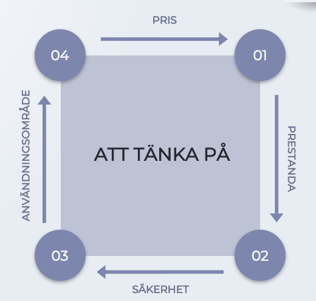

# Nätverksutrustning
## Digital kommunikationsteknik

---

# Mål!
## Översikt av olika typer av nätverksutrustning
Använd de röda markeringarna för att göra anteckningar….

---

# HUB
 - Ansluter enheter till nätverket 
 - All data som hubben tar emot skickas ut till alla portar på hubben (förstärkt)
 - Enkel utrustning som är föråldrad idag och används inte mer. 
 - Dålig prestanda
 - Dålig säkerhet
 - Jobbar enbart på fysisk nivå(Läser ej frames)

---

---

# SWITCH
 - Ansluter enheter till nätverket 
 - En switch jobbar på lager 2 i OSI-modellen
 - En switch läser av alla ”frames” och noterar avsändare och håller koll på mottagare **(för adressering används MAC-adresser)**
 - Detta görs med en MAC-table
 - En switch skickar bara frames till den port som switchen vet att mottagaren är ansluten till
 - Är mottagaren av en frame okänd så skickas frame’en ut på alla portar (utom sändarens). Kallas flooding. 
 - En switch lär sig **MAC-adresser** genom att läsa av användar-**MAC-adressen** på inkommande frames. 
 - Betydligt **bättre säkerhet och prestanda än en HUB**

---

---

# ROUTER
 - Används till att koppla samman nätverk med varandra
 - En router jobbar minst på nivå 3 enligt OSI-modellen (Paketnivå (**IP**) och uppåt)
 - Routrar är avancerade nätverksenheter som uppför sig som datorer och kör någon form av OS
 - Routrar är komplexa och flexibla och kan har flera **roller i nätverket** T.ex. agera brandvägg och/eller övervaka nätverkstrafiken
 - Använder en routing table för att skicka paketen rätt. 

---

# HEMMAROUTER
 - ISR (Integrated Service Router) även kallad en **multi-function device** eller hemmarouter/bredbandsrouter. 
 - Allt-i-ett enhet som fungerar som en **switch, router, accesspunkt, (modem). Oftast med brandväggsfunktioner.**
 - Billiga 
 - Fungerar bra till mindre nätverk

---

# REPEATER
 - Upprepar signalen
 - Tar emot signalen och förstärker den för att sedan skicka vidare signalen
 - Används för att utöka räckvidden
 - Alla hubbar och switchar förstärker även signalen

---

# MODEM
 - Modulator-Demodulator
 - Omvandlar digitala signaler till analoga och tvärt om
 - Används för att skicka data över ett analogt mediumT.ex. telefonlinjen !
 - Modem används främst till: 
    Traditionell telefonlinje 
    DSL
    Kabel

[Lyssna på modemet!](https://www.youtube.com/watch?v=aV8DEJ8ydJQ)

---

---

- # NÄTVERKSKORT
- ### **NIC** - **N**ETWORK **I**NTERFACE **C**ARD

* 
* 

---

# ACCESSPUNKT
 - **Wireless Access Point (AP)**
 - Kopplar samman flera trådlösa enheter med varandra och (oftast) ett trådbundet nät
 - **Kan ses som en HUB/Switch för trådlösa enheter**
 - Det finns flera olika standarderför WLAN och därmed flera varianter på AP

---

---

<!-- 

[Read more about MD](https://https://www.markdownguide.org/basic-syntax/). -->

---